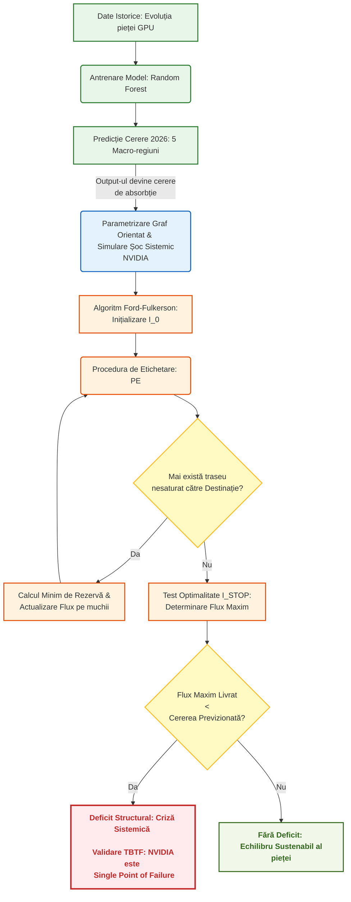

## Schema Logică a Arhitecturii Hibride

Mai jos este prezentată schema logică a modului în care componenta de Machine Learning (Predictivă) se integrează cu algoritmul matematic Ford-Fulkerson (Optimizare) pentru a simula și demonstra paradigma *Too Big to Fail*.

